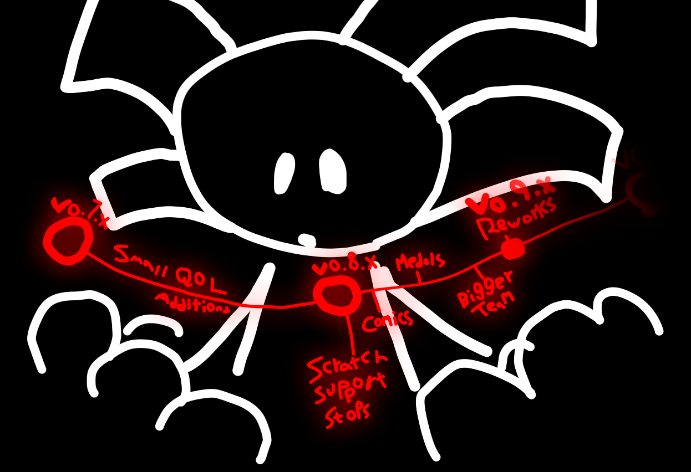

# Hello World We are Back!
Hello everybody! Did you miss us?

Well don't worry! We are back and we are alive!

Actively working on the game too. Slower than last time but we're getting there!

Now let's talk about some stuff relating to the game!

# Update Workings
Updates now work in a queue and we work on them at the same time, just some takes priority over others, y'know?

But yeah, it's like...

Update A - we workin on it

and Update B - we workin on it

if Update B is done first

it just sits in the background

waiting to be enabled and probably

get quality of life additions because why not y'know?

and yeah thats basically it.

# Scratch Version
Scratch version loses support by v0.8.

That will be the last version that has a scratch version

because we want to expand our scope beyond the limitations 

scratch forces upon us.

Also I wanna use JSON files for shit and fix the file size.

Seriously the file size is going to be an issue so

I wanna get to v0.8 A.S.A.P.

# Roadmap
I made a roadmap :D

lets do a quick summary

v0.7.x - QOL Stuff

v0.8.x - Scratch Support stops. We get medals, bigger team, no idea on the comic thing.

v0.9.x - Reworks.

and that's your roadmap for today. He he.
